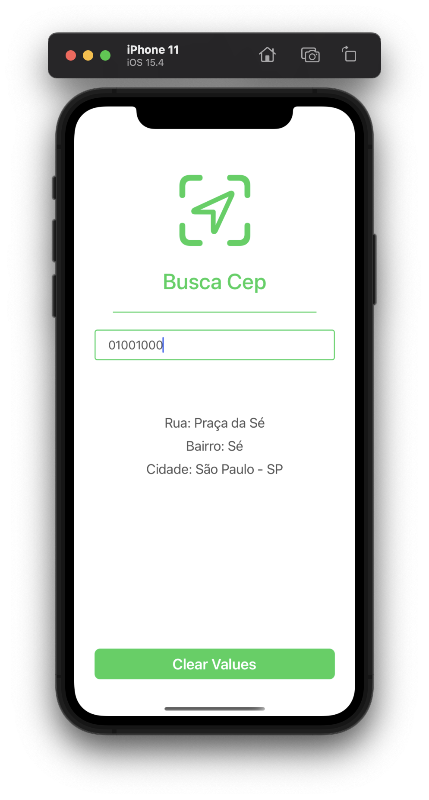

# Swift Busca Cep App

A simple App to find address info in brazil based on cep(zip) number.

<table>
  <tbody>
    <tr>
      <td></td>
      <td></td>
      <td></td>
    </tr>
  </tbody>
</table>

### Made with ###

- UIKit and ViewCode
- AutoLayout and Constraints
- Reusable Components: UILabel, UIButton, UITextField
- Protocols
- Consume **VIA CEP** api [VIA CEP](https://viacep.com.br/)
- URLSession
